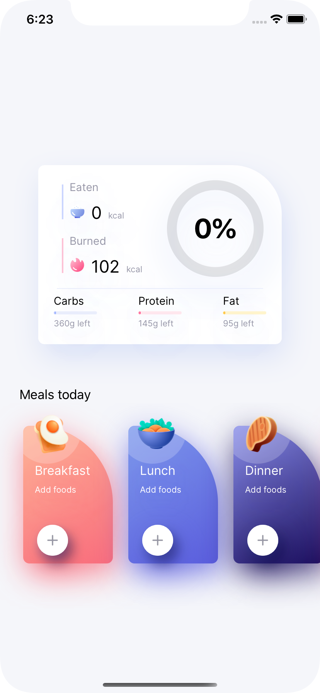
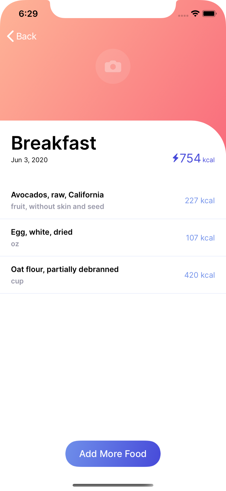
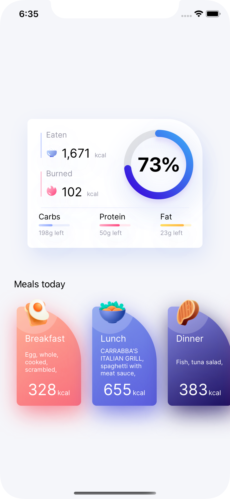

## MVVM pattern

<p align="center">
 


</p>


The _Model-View-ViewModel_ (MVVM) pattern is a UI design pattern. It’s a member of a larger family of patterns collectively known as _MV*_, these include [Model View Controller](http://en.wikipedia.org/wiki/Model%E2%80%93view%E2%80%93controller) (MVC), [Model View Presenter](http://en.wikipedia.org/wiki/Model%E2%80%93view%E2%80%93presenter) (MVP) and a number of others.

Each of these patterns addresses separating UI logic from business logic in order to make apps easier to develop and test. 

One of my favorite design patterns is Flux/Redux. Take a look another sample I have made [here](https://github.com/billidani7/MoviesComposableArchitecture).

MVVM programming with View Models is the new pattern that Apple is recommending developers follow after WWDC this year.


 _ViewModel_, is a special type of model that represents the UI state of the app. For example, it holds the current text of a text field or the items of a List.

### MVVM basic rules
MVVM pattern is following these strict rules:
1.  The View has a reference to the ViewModel, but not vice-versa.
2.  The ViewModel has a reference to the Model, but not vice-versa.
3.  The View has no reference to the Model or vice-versa.


Let’s consider a quick example of the MVVM module for a SwiftUI app. We will create a view with a text field and a List. Users would type a food name in the text field and the results would be shown in the List.

We will start with the model layer and move upwards to the UI.

### Model
```swift
struct Food: Codable {
    name: String
}
```

### View Model
```swift
// 1
class AddMealViewModel: ObservableObject {
	// 2
    @Published var searchText = ""
    @Published var foodResults: [Food] = []
	
	private var searchCancellable: AnyCancellable? {
        willSet {
            searchCancellable?.cancel()
        }
    }
    
    private var disposables = Set<AnyCancellable>()

    init() {
		//3
	$searchText
	    .dropFirst(1) //4
	    //5
	    .debounce(for: .seconds(0.5), scheduler: DispatchQueue.main) 
	    .sink(receiveValue: searchAction(forFood:)) //6
	    .store(in: &disposables) //7
    }
    
    func searchAction(forFood query: String) {
                
        searchCancellable = FDCClient
            .searchFoods(query: query) //8
            .replaceError(with: [Food]())
            .map{$0.foods}
            .subscribe(on: DispatchQueue.global())
            .receive(on: DispatchQueue.main)
            .assign(to: \.foodResults, on: self)
                                

    }
}
```
1. `ObservableObject` is a protocol that’s part of the **Combine** framework. It is used within a custom class/model to keep track of the state.

2. `@Published` is one of the most useful property wrappers in SwiftUI, allowing us to create observable objects that automatically announce when changes occur. Because the property is marked `@Published`, the compiler automatically synthesizes a publisher for it. SwiftUI subscribes to that publisher and and re-invoke the `body` property of any views that rely on the data.

3. The  `searchText`  property uses the  `@Published`  property wrappers so it acts like any other  `Publisher`. This means it can be observed and can also make use of any other method that is available to  `Publisher`.

4. When you create the observation,  `$searchText`  emits its first value. Since the first value is an empty string, you should skip it to avoid an unintended network call.

5. Use  `debounce(for:scheduler:)`  to provide a better user experience. Without it the  `searchAction` function would make a new HTTP request for every letter typed.  `debounce`works by waiting half a second (`0.5`) until the user stops typing and finally sending a value.

6. The  `searchText`  changes been observed by `sink(receiveValue:)`  and the  `searchAction(forFood:)` function executes an API call.

7.  Think of  `disposables`  as a collection of references to requests. Without keeping these references, the network requests you’ll make won’t be kept alive, preventing you from getting responses from the server.

8. `searchFoods(query:)` method makes the API Call. See details below. 

### View
```swift
struct AddMealView: View {
	//1
    @ObservedObject var viewModel: AddMealViewModel
    
    var body: some View {
        
        VStack {
	        //2 
            TextField("Search food", text: $viewModel.searchText)
            
            List(viewModel.foodResults) { food in
                Text(food.name)
            }
        }
    }
}
```
1. ObservedObject is a property wrapper type that subscribes to an observable object and invalidates a view whenever the observable object changes. In other words, when the `AddMealViewModel` changes, the view will observe its changes.

2. `$viewModel.searchText` establishes a connection between the values you’re typing in the `TextField` and the `AddMealViewModel`‘s `searchText` property. Using `$`allows you to turn the `searchText` property into a `Binding<String>`. This is only possible because `AddMealViewModel` conforms to `ObservableObject` and is declared with the `@ObservedObject` property wrapper.

### API 
For nutrient data we are going to use FoodData Central database. Its an integrated data system that provides expanded nutrient profile data from [U.S. DEPARTMENT OF AGRICULTURE](https://fdc.nal.usda.gov/api-guide.html). The FoodData Central API provides REST access. The API spec is also available on SwaggerHub [here](https://app.swaggerhub.com/apis/fdcnal/food-data_central_api/1.0.0)

We will start by defining a protocol with the API actions.

```swift
protocol FDCActions {
    static func searchFoods(query: String) -> AnyPublisher<FDCSearchFoodResponce, APIError>
    static func getFoodDetail(id: Int) -> AnyPublisher<FoodDetail, APIError>
}
```
We wil use the first method to search for foods and the second in order to get details when the user taps on a specific food. The result type of each method is a Publisher. The first parameter refers to the type it returns if the computation is successful and the second refers to the type if it fails.
```swift
struct FDCClient: FDCActions {
	
	private static let jsonDecoder = JSONDecoder()
	
	public static func searchFoods(query: String) -> AnyPublisher<FDCSearchFoodResponce, APIError> {
        
		let baseURL = URL(string: "https://api.nal.usda.gov/fdc/v1/foods/search")!
		var components = URLComponents(url: baseURL, resolvingAgainstBaseURL: true)
		components!.queryItems = [
		    URLQueryItem(name: "api_key", value: "xxxx"),
		    URLQueryItem(name: "dataType", value: "SR Legacy"),
		    URLQueryItem(name: "query", value: query),

		]

		    //1
		return URLSession.shared.dataTaskPublisher(for: components!.url!) 
		.map { $0.data } //2
		.decode(type: FDCSearchFoodResponce.self, decoder: jsonDecoder)//3
		.mapError{ APIError.parseError(reason: "\($0)") } //4
		.eraseToAnyPublisher() //5
    }
    
}
```
1.   Uses the new  `URLSession`  method  `dataTaskPublisher(for:)`  to fetch the data. This method takes an instance of  `URLRequest`  and returns either a tuple  `(Data, URLResponse)`  or a  `URLError`.
2. Map the returned `Data`
3. The returned data is in JSON format. We use `JSONDecoder` to decode the response to an Object of type `FDCSearchFoodResponce`. This type conforms to `Codable` . So we are able to decode the response to our custom type.
4. If an error occurred , we use `mapError` method to handle it.
5. `eraseToAnyPublisher()` exposes an instance of [`AnyPublisher`](https://developer.apple.com/documentation/combine/anypublisher) to the downstream subscriber, rather than this publisher’s actual type.


### Links
[Stanford University Lecture](https://www.youtube.com/watch?v=4GjXq2Sr55Q)
